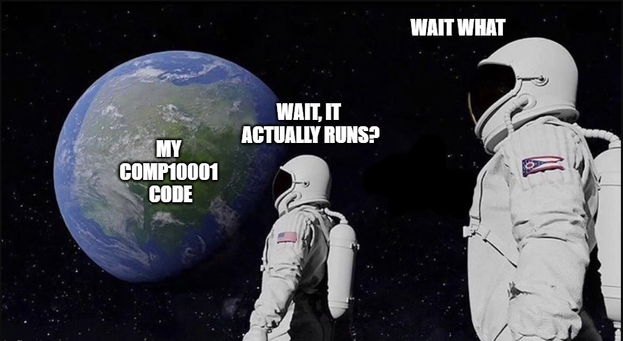

# COMP10001 Agenda and Tutorial Coverage
**This subject is here to test your conceptual understanding on top of your programming ability. Don't fall into the trap of assuming the exam is easy just because you have all the Green Diamonds on Grok!**
```
Name: Akira Takihara Wang
Staff: akira.wang@unimelb.edu.au
```
Tutorial content is slightly out of sync compared to usual (due to COVID).

### Times
##### Wed 9am - 10am 
https://unimelb.zoom.us/s/99094275769

##### Thurs 5:15pm - 6:15pm
https://unimelb.zoom.us/s/94153061149

##### Monday 6 - 7pm 
Live Consultation

### Python Documentation
- [All Python String Methods](https://docs.python.org/3/library/stdtypes.html#string-methods).
- [Useful Dictionary operations and methods](https://docs.python.org/3/library/stdtypes.html#dict.get).
- [The collections Library for additional data structures](https://docs.python.org/3/library/collections.html#counter-objects).

### My Recommended Tools for Tech
- Search Engine: [Duck Duck Go](https://duckduckgo.com/)
- Stack Overflow (Yahoo answers / Quora for programmers): [Stack Overflow](https://stackoverflow.com/)
- Code Editor: [VS Code](https://code.visualstudio.com/)
- Browser: [Brave - based off Chronium with in-built adblocking](https://brave.com/)

### Relevant Meme:


Please attribute your code if you take it from stackoverflow. We know what's yours and what's not :^)
